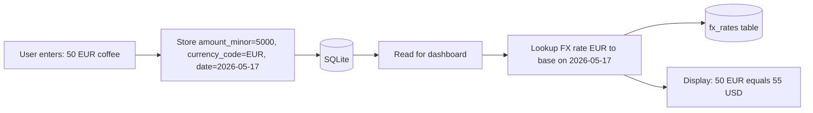

# Expense Tracker — Product Specification & Development Roadmap

## 1. Project Overview

**Project Name:** Expense Tracker  
**Platform:** Desktop first, with a path toward mobile support  
**Primary Goal:** Build a fast, privacy-focused, local-first expense tracking application that helps users record spending quickly and understand their financial habits without requiring accounts or cloud services.

This application is designed for people who want a lightweight and efficient way to track daily expenses on their own device. The app should be simple enough for daily use, but powerful enough to provide useful insights, budgeting tools, recurring expense support, and export/backup options.

---

## 2. Problem Statement

Many expense tracking apps are either too complex, too slow for daily use, or depend on cloud accounts and online synchronization. Users who only want a private, offline, and fast way to log expenses often end up abandoning these apps because of friction in the interface or unnecessary setup requirements.

This project solves that problem by providing:
- Fast expense entry
- Offline-first local storage
- No login or account creation
- Simple but useful analytics
- A clean UI that encourages consistent daily use

---

## 3. Product Goals

### Primary Goals
1. Allow users to add an expense in a few seconds.
2. Store all data locally on the device.
3. Provide a clear dashboard for spending visibility.
4. Keep the interface simple, modern, and easy to navigate.
5. Support cross-platform development using a shared codebase.

### Secondary Goals
1. Support budgets and recurring expenses.
2. Allow exporting and backing up user data.
3. Offer search, filtering, and category management.
4. Provide a responsive layout that can adapt to different screen sizes.
5. Prepare the architecture so mobile support can be added later.

---

## 4. Target Users

The application is intended for:
- Individuals who want private expense tracking without cloud sync
- Students managing personal spending
- Freelancers who need simple local financial tracking
- Users who prefer keyboard shortcuts and fast input
- People who want a lightweight desktop app instead of a heavy finance suite

---

## 5. Core Product Principles

### 5.1 Privacy First
- No mandatory login
- No cloud account
- No external tracking
- Data stored locally on the user’s device

### 5.2 Speed First
- Expense entry should take only a few seconds
- Frequently used actions should be accessible from shortcuts
- The app should feel lightweight and responsive

### 5.3 Simplicity First
- Avoid unnecessary screens and complex workflows
- Keep the dashboard clean and readable
- Only show what users need for daily decisions

### 5.4 Local Control
- Users should own their data
- Backups and exports should be fully available
- Data should be portable and easy to restore

### 5.5 Cross-Platform Readiness
- Use a stack that can support desktop today and mobile later
- Avoid OS-specific logic where possible
- Keep the UI responsive from the start

---

## 6. Recommended Technology Stack

## 6.1 Core Stack
- **Tauri** — Application shell for building desktop applications with a web frontend and Rust backend
- **React** — Frontend framework for UI and interaction
- **Rust** — Backend logic, native operations, and secure system access
- **SQLite** — Local database for storing app data

## 6.2 Frontend Tooling
- **Vite** — Fast development server and build tool
- **TypeScript** — Static typing for safer and more maintainable code
- **Tailwind CSS** — Utility-first styling for rapid UI development
- **shadcn/ui** or **Radix UI** — Accessible UI components and primitives

## 6.3 State Management
- **Zustand** — Simple and lightweight global state management

## 6.4 Charts and Visualization
- **Recharts** — Visual charts for dashboard analytics. Chosen over Chart.js because it is React-native, declarative, integrates cleanly with the component model, and is well-suited to the dashboard-style charts this app needs.

## 6.5 Backend and Tauri Plugins
- **tauri-plugin-sql** — SQLite access through Tauri
- **tauri-plugin-store** — Local key-value storage for settings and preferences
- **tauri-plugin-fs** — File system access for exports and backups

## 6.6 Productivity and Utility Libraries
- **React Hook Form** — Form handling and validation
- **Day.js** — Lightweight date manipulation and formatting

---

## 7. Architecture Overview

The app should be built using a layered architecture:

```text
React UI
   ↓
Application State (Zustand)
   ↓
Tauri Commands / API Calls
   ↓
Rust Backend Logic
   ↓
SQLite Database / File System
```

### Responsibilities by Layer

#### 7.1 React UI Layer
- Render screens and components
- Handle user interactions
- Display charts, lists, and forms
- Trigger commands to the backend

#### 7.2 State Layer
- Manage selected filters, UI state, cached records, and form state
- Keep app interactions fast and predictable

#### 7.3 Rust Backend Layer
- Provide secure operations
- Handle file exports and backups
- Perform database access through commands or plugin calls
- Enforce data integrity for critical actions

#### 7.4 SQLite Layer
- Store expenses, categories, budgets, recurring rules, and settings
- Keep the app local-first and portable

---

## 8. Application Scope

## 8.1 In Scope
- Expense tracking
- Category management
- Dashboard analytics
- Search and filtering
- Budgets
- Recurring expenses
- Multi-currency support with FX conversion
- Export and backup
- Dark mode
- Responsive desktop-friendly UI
- Local storage only

## 8.2 Out of Scope for MVP
- User accounts
- Cloud sync
- Multi-user collaboration
- Bank account connection
- Financial institution integrations
- Complex tax reporting
- Payment processing

---

## 9. Detailed Feature Specification

## 9.1 Expense Entry
The app must provide a fast and simple way to add expenses.

### Required fields
- Amount
- Category
- Date
- Optional note
- Optional payment method
- Optional tags

### Expected behavior
- Default date should be today
- Category should remember the last selected value
- Amount input should be the first focus field
- The form should support keyboard navigation
- Expense should be saved locally immediately after submission

### Optional advanced behavior
- Quick-add parsing such as: `50 food lunch`
- Auto-suggest categories based on previous entries
- Auto-fill date and category from recent usage

---

## 9.2 Categories System
Users need flexible categories to organize spending.

### Requirements
- Create category
- Edit category
- Delete category
- Assign color or icon
- Mark a category as active/inactive
- Prevent deletion of categories in use unless reassignment is handled

### Default categories example
- Food
- Transport
- Bills
- Shopping
- Entertainment
- Health
- Education
- Rent
- Savings
- Other

---

## 9.3 Dashboard
The dashboard should help users understand their financial habits quickly.

### Dashboard widgets
- Total spent this month
- Total spent this week
- Spending by category
- Daily spending trend
- Recent transactions
- Budget progress
- Top spending categories

### Design principle
The dashboard should remain clean and should not overwhelm the user with too many charts.

---

## 9.4 Monthly and Weekly Views
Users should be able to review spending over time.

### Requirements
- Filter by month
- Filter by week
- Filter by category
- View totals for the selected period
- Sort transactions by date, amount, or category

### Expected output
- Summary statistics
- Transaction list
- Visual breakdown
- Comparison with previous period

---

## 9.5 Search and Filtering
The app must support powerful search while remaining simple.

### Search capabilities
- Search by note text
- Search by category
- Search by amount range
- Search by date range
- Search by tag

### Filter capabilities
- Filter by category
- Filter by date period
- Filter by amount range
- Filter by recurring/non-recurring
- Filter by paid method if supported

---

## 9.6 Budgets
Budgeting helps users control spending.

### Requirements
- Set monthly budget overall
- Set budget per category
- Show progress bars
- Warn when user approaches or exceeds budget
- Compare budget versus actual spending

### Suggested behavior
- 80% usage = warning state
- 100% usage = limit exceeded state

---

## 9.7 Recurring Expenses
The app should support regularly repeating expenses.

### Examples
- Rent
- Subscriptions
- Internet
- Utilities
- Memberships

### Requirements
- Create recurring rule
- Specify frequency (weekly, monthly, yearly)
- Enable/disable recurring item
- Automatically generate future entries or reminders
- Edit recurrence rules without breaking history

### Implementation approach
Use a **hybrid model**: the recurrence rule is stored as the source of truth, and concrete expense rows are materialized only when an occurrence becomes due (or when the user explicitly confirms it). This avoids cluttering the database with far-future entries while keeping past occurrences fully editable as ordinary expense rows.

---

## 9.8 Smart Insights
The app should provide lightweight insights rather than overly complex analytics.

### Example insights
- “Food spending increased by 18% compared to last month.”
- “Friday is your highest spending day.”
- “You exceeded your transport budget this week.”
- “Most of your expenses fall under two categories.”

### Important note
Insights should be helpful and understandable, not overly technical.

### Implementation approach
MVP insights are produced by **rule-based heuristics computed locally** inside the Rust backend. There is no machine learning, no LLM, and no telemetry of any kind — all computation happens on-device against the local SQLite database, in keeping with the privacy-first principle.

### Initial heuristic rules
1. **Month-over-month delta per category** — flag any category whose spend changed by more than ±15% versus the prior month.
2. **Day-of-week pattern** — identify the weekday with the highest average spend over the trailing 8 weeks.
3. **Budget threshold breach** — surface any budget that has crossed the 80% (warning) or 100% (exceeded) threshold for the current period.
4. **Category concentration** — note when two or fewer categories account for more than 60% of monthly spend.
5. **Unusual single transaction** — flag any expense that is more than 3× the median for its category in the trailing 90 days.

Each rule is implemented as a pure function over query results and is independently testable. New rules can be added without changing the insight delivery layer.

---

## 9.9 Export and Backup
Because the app is local-only, data protection is critical.

### Requirements
- Export data to CSV
- Export data to JSON
- Optional Excel export if feasible
- Manual backup and restore
- Auto-backup to a chosen folder or default local backup directory
- Confirm before overwrite or restore

### Backup strategy
- Backup SQLite database file
- Optional structured export file for portability
- Timestamped backup filenames

### Backup integrity
Every backup operation produces three artifacts in a single timestamped folder:
1. The raw SQLite database file (or encrypted blob — see below).
2. A `manifest.json` describing the backup contents.
3. A SHA-256 checksum file (`backup.sha256`) covering the database file.

The manifest must include:
- `app_version` — the version of the app that produced the backup
- `schema_version` — the database schema version
- `created_at` — UTC ISO 8601 timestamp
- `record_counts` — number of expenses, categories, budgets, recurring rules
- `base_currency` — the user's configured base currency at backup time
- `encrypted` — boolean indicating whether the database file is encrypted

On restore, the checksum is verified before any database operation runs. A failed checksum aborts the restore with a clear error.

### Restore conflict policy
When restoring into an app that already contains data, the user must choose one of three modes:
1. **Replace** — wipe the current database and load the backup wholesale. Requires explicit confirmation and produces an auto-backup of the current state before wiping.
2. **Merge** — additive restore that deduplicates rows by primary key (`id`). New rows are inserted; existing rows are skipped (never overwritten).
3. **Dry-run** — perform a full restore simulation against a temporary database and present a summary (rows added, conflicts found) without modifying the live database.

### Optional encryption
Backups can be encrypted at the user's request using **AES-256-GCM** with a key derived from a user-provided passphrase via **Argon2id**. Encryption is **off by default** to keep the privacy-first promise compatible with portability — encryption is opt-in for users who want extra protection on shared filesystems or cloud-synced folders.

---

## 9.10 Receipt Attachment
The app may support receipt storage as an advanced feature.

### Requirements
- Attach an image to an expense
- Store receipt metadata
- Preview receipt
- Open receipt file from the app
- Keep file references stable even after app restart

### Notes
This feature can be implemented later because it adds complexity to file management and storage.

---

## 9.11 Notifications and Reminders
Notifications can improve consistency.

### Possible reminders
- Daily expense logging reminder
- Budget threshold alert
- Recurring expense due reminder
- Backup reminder

### Design principle
Notifications must be optional and user-controlled.

---

## 9.12 Theme and Appearance
The app should support visual preferences.

### Requirements
- Dark mode
- Light mode
- Remember user preference locally
- Optional accent color customization

---

## 9.13 Multi-Language Support
Internationalization (i18n) is built into the foundation rather than retrofitted, so that adding a new language is a translation task rather than a refactor.

### Library and structure
- **`i18next`** plus **`react-i18next`** for translation lookup and React integration.
- Translation files live under `src/locales/{lang}/{namespace}.json` (for example `src/locales/en/common.json`, `src/locales/ar/common.json`).
- Namespaces are grouped by feature area (`common`, `expenses`, `budgets`, `settings`) to keep bundle splitting feasible later.
- No raw user-facing string ever lives in a component — every visible string flows through `t()`.

### RTL support
- Each language declares its direction (`ltr` or `rtl`) in a small language manifest.
- On language change, the app sets `dir` and `lang` on the `<html>` element.
- All styling uses **logical CSS properties** (`margin-inline-start`, `padding-block-end`, `inset-inline`, `text-align: start`) instead of physical ones (`margin-left`, `padding-bottom`, `left`, `text-align: left`) so layouts mirror correctly under RTL.
- Tailwind's logical-property utilities (`ms-*`, `me-*`, `ps-*`, `pe-*`, `start-*`, `end-*`) are used in preference to their physical counterparts.

### Initial languages
- English (LTR) — default
- Arabic (RTL)

### Date, number, and currency formatting
- All formatting goes through the browser's `Intl` API (`Intl.DateTimeFormat`, `Intl.NumberFormat`) bound to the active locale.
- Day.js is configured with the matching locale plugin for any operations not covered by `Intl`.

---

## 9.14 Money & Currency Strategy
The app supports full multi-currency tracking with foreign-exchange (FX) conversion, while keeping all computation local and privacy-preserving.

### Storage representation
- All monetary amounts are stored as `INTEGER` values representing **minor currency units** (cents for USD, fils for AED, etc.). Floating-point types are never used for money — this eliminates rounding errors that would compound over thousands of transactions.
- The number of minor units per major unit is determined by the ISO 4217 metadata for the currency (most are 100; some, like JPY, are 1).

### Base currency
- The user configures a **base currency** in settings.
- Every aggregated number shown in the app — dashboard totals, budget progress, insights, category breakdowns — is computed and displayed in the base currency.
- The base currency can be changed at any time; existing data is not rewritten, but all aggregations recompute against the new base.

### Per-expense currency
- Each expense stores its own `currency_code` (ISO 4217) and `amount_minor`.
- When the expense currency differs from the base currency, the app converts using the FX rate effective on the expense `date` (snapshot semantics, not live).
- If no rate is available for a given currency pair on a given date, the app uses the most recent rate at or before that date. If none exists at all, the expense is shown in its original currency only and excluded from aggregates with a visible warning.

### FX rates store
- Rates live in a local `fx_rates` table with columns `from_code`, `to_code`, `rate`, `as_of_date`.
- Rates can be entered manually or imported in bulk from a CSV file the user provides. There is **no automatic online lookup by default** — this preserves the privacy-first principle.
- An optional, explicitly user-enabled provider integration may be added later behind a feature flag, but it is out of scope for the MVP.

### Display rules
- Expense lists show the original amount plus the converted amount when the two currencies differ (for example: `50.00 EUR (≈ 55.00 USD)`).
- Totals, charts, and insights always show the base currency only.
- Currency symbols and number formatting follow the active i18n locale via `Intl.NumberFormat`.

### Conversion flow



---

## 9.15 Timezone & Date Handling
Date and time handling is explicit and stable across timezones, so that travel and DST never reshuffle a user's history.

### Storage rules
- All timestamps (`created_at`, `updated_at`, `deleted_at`) are stored as **UTC ISO 8601 strings** in SQLite.
- The expense's calendar `date` is stored as a **naive `YYYY-MM-DD` string** in the user's local timezone at the moment of entry. "Lunch on Friday" stays on Friday regardless of where the user opens the app later.
- The app never converts the calendar `date` field on display. Only timestamps are localized.

### Week start
- The user can configure the **week start day** in settings (default Monday, per ISO 8601).
- All "this week" / "last week" rollups, charts, and insights use the configured week start.

### Travel scenario
- When the device moves to a different timezone:
  - Past expenses keep their original `date` field (no shifting).
  - New expenses pick up the new local timezone for their `date` field automatically.
  - Timestamps (`created_at`, etc.) continue to be stored in UTC and displayed in the device's current local timezone.

### Aggregation boundaries
- "Today", "this week", "this month", and "this year" boundaries are computed against the **device's current local timezone**, not against UTC, so the boundaries match the user's expectation.
- Date-range filters and reports use the same convention.

---

## 10. UX / UI Requirements

## 10.1 General UI Guidelines
- Clean layout
- Minimal clutter
- Good spacing and typography
- Clear visual hierarchy
- Touch-friendly spacing for mobile later
- Keyboard-friendly navigation for desktop

## 10.2 Navigation
Suggested main navigation:
- Dashboard
- Expenses
- Categories
- Budgets
- Reports
- Settings

## 10.3 Quick Actions
- Add expense
- Search
- Export data
- Backup now
- Open settings

## 10.4 Layout Strategy
- Desktop: sidebar + content panel
- Mobile later: single-column responsive layout
- Avoid complex multi-panel interfaces that do not scale well

---

## 11. Data Model Specification

## 11.1 Expenses Table
Suggested fields:
- id
- amount_minor (INTEGER, minor currency units)
- currency_code (TEXT, ISO 4217)
- category_id
- date (TEXT, naive `YYYY-MM-DD` in user local timezone at entry time)
- note
- payment_method
- is_recurring
- recurrence_id
- created_at (TEXT, UTC ISO 8601)
- updated_at (TEXT, UTC ISO 8601)
- deleted_at (TEXT, UTC ISO 8601, nullable — soft delete)

## 11.2 Categories Table
Suggested fields:
- id
- name
- color
- icon
- is_active
- created_at
- updated_at
- deleted_at (nullable — soft delete)

## 11.3 Budgets Table
Suggested fields:
- id
- category_id (nullable for global budget)
- limit_amount_minor (INTEGER, minor currency units)
- currency_code (TEXT, ISO 4217)
- period_type
- created_at
- updated_at
- deleted_at (nullable — soft delete)

## 11.4 Recurring Rules Table
Suggested fields:
- id
- title
- amount_minor (INTEGER, minor currency units)
- currency_code (TEXT, ISO 4217)
- category_id
- frequency
- start_date
- end_date (optional)
- is_active
- created_at
- updated_at
- deleted_at (nullable — soft delete)

## 11.5 Settings Table or Store
Suggested fields:
- theme
- language
- direction (`ltr` or `rtl`, derived from language but stored for fast read)
- base_currency (ISO 4217)
- week_start_day (0=Sunday … 6=Saturday, default 1=Monday)
- backup_path
- auto_backup_enabled
- notifications_enabled
- last_opened_view

### Query guidance
All SELECT queries against tables that support soft delete must filter `WHERE deleted_at IS NULL` unless the user is explicitly viewing a "Trash" or "Recently deleted" view. The recommended pattern is a SQL view per table (`v_expenses_active`, `v_categories_active`, etc.) that wraps the live filter, so application code cannot accidentally read tombstoned rows.

## 11.6 FX Rates Table
Backs the multi-currency conversion described in Section 9.14.

Suggested fields:
- id
- from_code (TEXT, ISO 4217)
- to_code (TEXT, ISO 4217)
- rate (REAL, units of `to` per 1 unit of `from`)
- as_of_date (TEXT, `YYYY-MM-DD`)
- source (TEXT, e.g. `manual`, `csv_import`)
- created_at
- updated_at

Indexes:
- Unique index on (`from_code`, `to_code`, `as_of_date`) — only one rate per pair per day.
- Composite index on (`from_code`, `to_code`, `as_of_date` DESC) to make "latest rate at or before date X" lookups fast.

## 11.7 Database Migrations
Schema evolves over the lifetime of the app, so migrations are a first-class concern from day one.

### Mechanism
- Migrations run through **`tauri-plugin-sql`**'s built-in migration support.
- Each migration is a numbered SQL file under `src-tauri/migrations/`:
  - `0001_init.sql`
  - `0002_add_fx_rates.sql`
  - `0003_add_soft_delete_columns.sql`
  - …and so on, monotonically increasing.
- Applied versions are tracked in a `schema_migrations` table managed by the plugin.

### Startup behavior
- On app startup, the backend detects the current DB schema version and runs any pending migrations forward inside a single transaction.
- If a migration fails partway, the transaction rolls back and the app refuses to start with a clear error pointing to the failing migration.

### Safety rules
- **No migration may run without a pre-migration auto-backup** of the database file. The backup lives alongside the database with a `.pre-migration-{from_version}-to-{to_version}.bak` suffix.
- The app **refuses to start** if the DB schema version is newer than what the binary knows about. This prevents data corruption from accidentally opening a newer DB with an older app (for example, after a downgrade).
- Migrations are forward-only. Downgrades are handled by restoring the pre-migration backup, not by running reverse SQL.

### Authoring rules
- Migrations are immutable once shipped. Never edit a released migration file; always add a new one.
- Each migration is small and focused (one logical change).
- Destructive operations (drop column, drop table, rename) require an additional pre-flight check that no in-flight transactions or open connections exist, plus an explicit user confirmation dialog on first run.

## 11.8 Soft Delete Behavior
The `deleted_at` column on Expenses, Categories, Budgets, and Recurring Rules implements **soft delete**, where rows are tombstoned rather than removed.

### Default behavior
- Deleting any row via the UI sets `deleted_at` to the current UTC timestamp.
- Active queries filter `WHERE deleted_at IS NULL` (typically via the `v_*_active` SQL views described in 11.5).
- Aggregations, charts, dashboards, budgets, and insights all ignore soft-deleted rows.

### Undo window
- Soft-deleted rows remain recoverable from a dedicated **Trash** view for **30 days** after deletion.
- The user can restore a row (clears `deleted_at`) or permanently delete it from the Trash view.
- A background sweep on app startup hard-deletes rows whose `deleted_at` is older than the configured window.

### Backup interaction
- Backups include soft-deleted rows so that an undo performed after restore still works.
- The manifest's `record_counts` reports both active and tombstoned counts.

### Referential integrity
- Soft-deleting a category that is in use is allowed, but the category is hidden from pickers. Existing expenses retain their `category_id` pointer; if the category is later hard-deleted, those expenses are reassigned to a built-in "Uncategorized" category by a transactional fix-up step (also covered by the migration safety rules in 11.7).

---

## 12. Non-Functional Requirements

## 12.1 Performance
- App should open quickly
- Adding an expense should feel instant
- Dashboard data loading should remain responsive
- App should handle thousands of expense records without major slowdown

## 12.2 Privacy
- No account system
- No cloud dependency
- No unnecessary data collection

## 12.3 Reliability
- Data should not be lost after restart
- Backup and restore should be safe
- App should recover gracefully from invalid input or partial failures

## 12.4 Maintainability
- Use clean module boundaries
- Keep frontend and backend responsibilities clear
- Prefer reusable components and services

## 12.5 Cross-Platform Compatibility
- Avoid OS-specific assumptions
- Use portable file paths
- Keep UI adaptable to different screen sizes

---

## 13. Error Handling Requirements

The app should handle common errors gracefully.

### Examples
- Invalid expense amount
- Missing required category
- Database write failure
- Backup failure
- Corrupted import file
- Missing receipt file path

### Required behavior
- Show clear user-friendly error messages
- Avoid crashing the app
- Keep logs for debugging
- Allow retry where possible

---

## 14. Security and Data Integrity

Even though the app is local, data safety still matters.

### Requirements
- Validate all form inputs
- Avoid unsafe file paths
- Prevent accidental deletion of important data
- Use safe database operations
- Confirm destructive actions
- Keep backup and restore operations controlled

---

## 15. Development Roadmap

## Phase 0 — Planning and Foundation
**Goal:** Define the product and prepare the codebase.

### Deliverables
- Finalized feature list
- Final design direction
- Database schema draft
- Project folder structure
- Technology setup
- Base Tauri + React + Rust project initialized

### Output
A clean foundation ready for feature development.

---

## Phase 1 — MVP Core Expense Tracker
**Goal:** Build the smallest useful version of the app.

### Features
- Add expense
- View expenses list
- Delete/edit expense
- Categories system
- Basic dashboard
- Local SQLite storage
- Light/dark mode
- Simple search

### Success criteria
- User can record and review spending reliably
- Data persists locally
- UI feels fast and usable

---

## Phase 2 — Reporting and Usability
**Goal:** Make the app more insightful and easier to use.

### Features
- Weekly and monthly views
- Charts and category breakdowns
- Sorting and advanced filtering
- Budget tracking
- Better dashboard summaries
- Keyboard shortcuts

### Success criteria
- User can understand spending patterns quickly
- App remains responsive with more data

---

## Phase 3 — Data Safety and Productivity
**Goal:** Add trust and convenience features.

### Features
- Export to CSV/JSON
- Backup and restore
- Auto-backup
- Recurring expenses
- Optional reminders/notifications
- Improved settings screen

### Success criteria
- User can protect and recover local data
- Repeating expenses are handled automatically

---

## Phase 4 — Advanced Experience Layer
**Goal:** Add higher-value features after the core product is stable.

### Features
- Smart insights
- Receipt attachment
- Multi-language support
- Better analytics comparisons
- Category suggestions
- Advanced quick-add input

### Success criteria
- App feels more intelligent without becoming complicated

---

## Phase 5 — Cross-Platform Expansion
**Goal:** Prepare and adapt the app for mobile support.

### Features
- Responsive UI refinements
- Touch-friendly layouts
- Mobile navigation patterns
- Mobile-friendly forms
- Tauri mobile build preparation

### Success criteria
- Same product logic works across desktop and mobile
- Interface remains usable on smaller screens

---

## Phase 6 — Polish and Release
**Goal:** Make the product stable and presentable.

### Features
- UI cleanup
- Bug fixes
- Performance improvements
- Final accessibility review
- Packaging and release builds
- Documentation and onboarding

### Success criteria
- The app is ready for real use or portfolio presentation

---

## 16. Suggested Build Order

To reduce complexity, build in this order:

1. Project setup
2. Database schema
3. Add expense form
4. Expense list view
5. Categories management
6. Dashboard summary
7. Charts and analytics
8. Search and filtering
9. Budget feature
10. Export and backup
11. Recurring expenses
12. Settings and theme
13. Polish and responsive design
14. Mobile readiness

---

## 17. Acceptance Criteria for the MVP

The MVP is complete when:

- A user can add an expense in under a few seconds
- Expenses are saved locally in SQLite
- Categories can be created and assigned
- Dashboard shows meaningful spending summaries
- Search and filter work correctly
- The app supports dark mode
- Data can be exported or backed up
- The app runs as a stable desktop application

---

## 18. Final Product Vision

The final product should be a fast, private, and elegant expense tracker that helps users understand their spending with minimal effort. It should feel simple enough for everyday logging, but strong enough to become a trustworthy financial companion over time.

---

## 19. Notes for the AI Builder

When building this app, prioritize:
- Clean architecture
- Strong separation of frontend and backend responsibilities
- Local-first data handling
- Simple UX over unnecessary complexity
- Responsive layout from the beginning
- Small, testable steps instead of a large monolithic build

The best implementation strategy is to build a reliable MVP first, then expand the app in phases.
